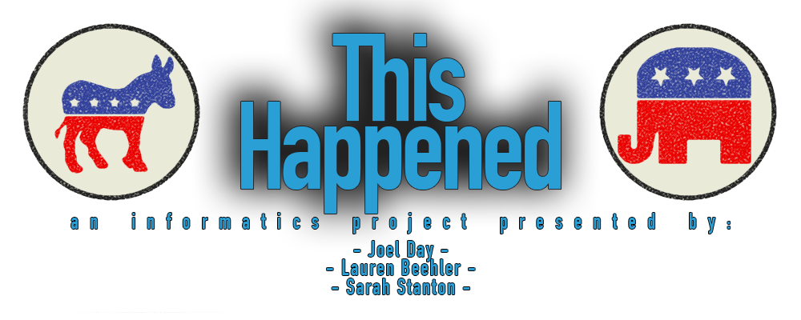

### Please visit [so.thishappened.net](so.thishappened.net)

The goal of this project is to allow anyone to easily get a holistic and revealing view on political and social trends during this election period. Social media has become an increasingly important aspect of campaigning in recent years and we seek to make the process of analyzing the candidates and the impact of social media easier.

Through the use of this program, you can analyze many of the aspects of the elections. Our real-time, streaming tweets allow you to sample the content of the digital correspondence surrounding the election. Our map allows you to see the relative geological spread of the tweets from the 25th of Februrary to today. We've also included a line chart which reveals total mentions and social activity around and after significant events like Super Tuesday and the other primaries and caucuses. This report is not just about the people's interactions, we've also included a graph outlining the daily twitter interactions of the various candidates official Twitter handles.

Using Twitters APIs, we were able to compile the tweet data and segregate by each candidate.

It was built using:

- R
- Shiny
- Markdown
- The Twitter Streaming & Search APIs
